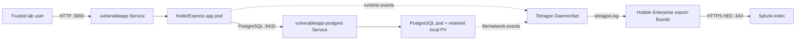

# Vulnerable-AI-KB Kubernetes training lab

This repository deploys an intentionally vulnerable citizen self-service
portal with synthetic records, PostgreSQL, Tetragon runtime security events,
Hubble Enterprise Fluentd export, and Splunk HEC integration.

Use this project only on an isolated training host or trusted lab network. Do
not expose it to the public internet. The application and SQL endpoints are
intentionally vulnerable.

## Architecture



The application initiates database connections to PostgreSQL on port `5432`.
The remaining database tracing policy monitors PostgreSQL file activity and
database-initiated outbound TCP connections to IPs other than the configured
application destination allowlist.

## Choose an installation workflow

### Guided installation

Use the existing phase-by-phase workflow when you want confirmation and
validation at each stage:

- Skill: [guided Kubernetes installation](skills/install-vulnerableapp-kubernetes/SKILL.md)
- Detailed commands: [installation_readme.md](installation_readme.md)

Invoke it explicitly with the `install-vulnerableapp-kubernetes` skill. It
preserves manual gates, pauses for missing credentials, and does not replace an
existing cluster automatically.

### Automated installation

Use the automated workflow when you want the agent to run the setup from start
to finish after configuration is prepared:

- Skill: [automated Kubernetes installation](skills/automated-install-vulnerableapp-kubernetes/SKILL.md)
- Configuration template: [installation-config.yaml.example](installation-config.yaml.example)

Prepare the local configuration file:

```bash
cp installation-config.yaml.example installation-config.yaml
chmod 600 installation-config.yaml
```

Populate the sudo account, database password, OpenAI key, Hubble Enterprise
settings, and Splunk HEC settings. Never commit or share
`installation-config.yaml`; credentials belong only in that local ignored file.
The automated skill still validates existing resources and stops on unsafe
cluster conflicts.

## Repository layout

```text
installation_readme.md                              Detailed installation source
skills/install-vulnerableapp-kubernetes/            Guided skill
skills/automated-install-vulnerableapp-kubernetes/  Automated skill
installation-config.yaml.example                   Automated config template
k8s/                                                 Kubernetes manifests and policy
personal_ai_assistant.py                             Assistant implementation
server.js                                            Application server
```

## Runtime checks

After deployment, the application health endpoints are:

```bash
curl http://<node-ip>:3000/healthz
curl http://<node-ip>:3000/readyz
```

Expected responses are `{"status":"ok"}` and `{"status":"ready"}`.

Check the observability components:

```bash
kubectl get pods -n vulnerableapp
kubectl get pods -n vulnerableapp-db
kubectl get pods -n kube-system -l app.kubernetes.io/name=tetragon
kubectl get pods -n kube-system -l app.kubernetes.io/instance=hubble-enterprise
kubectl logs -n kube-system ds/hubble-enterprise -c export-fluentd
```

In Splunk, search the configured index:

```spl
index="<SPLUNK_INDEX>" | head 10
```

For complete phases, troubleshooting, Hubble Enterprise values, Tetragon
policies, and cleanup guidance, use
[installation_readme.md](installation_readme.md).
